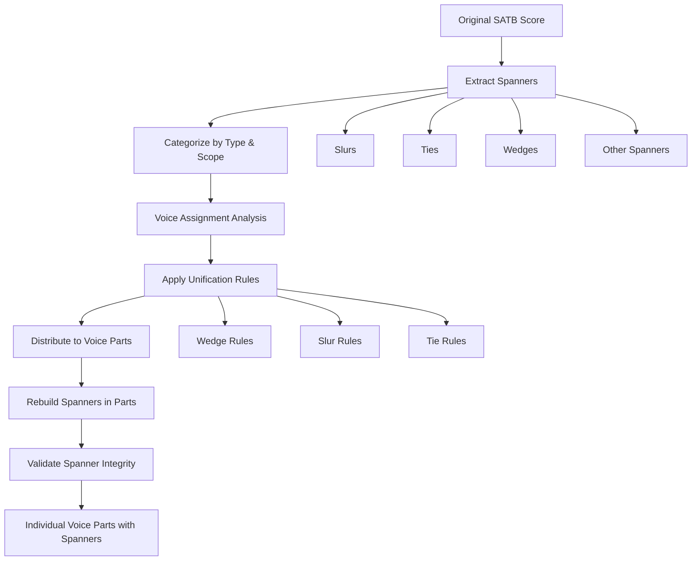

# SATB Splitter: Spanner Support Implementation Plan

## Overview

This document outlines the comprehensive plan for adding spanner support to the SATB splitter project. Spanners are musical elements that span across multiple notes or measures, including slurs, ties, and wedges (hairpins for crescendo/diminuendo).

## Current State Analysis

### Existing Architecture
- Successfully splits SATB voices from closed-score format into separate parts
- Handles notes, rests, dynamics, lyrics, tempo markings, and layout elements
- Uses [`music21`](https://web.mit.edu/music21/) for music processing
- Implements unification rules for dynamics and lyrics in [`satb_splitter/unification.py`](satb_splitter/unification.py)

### Missing Spanner Support
- No current handling of spanners (slurs, ties, wedges, etc.)
- Test file "Crossing The Bar.musicxml" contains extensive spanner examples:
  - 85+ spanner instances including wedges, ties, and slurs
  - Crescendo/diminuendo hairpins across multiple voices
  - Ties connecting notes across measures
  - Slurs for phrasing

## Implementation Plan

### Phase 1: Research and Analysis
**Goal**: Understand music21's spanner handling and create comprehensive spanner detection

#### 1.1 Music21 Spanner Investigation
Research [`music21.spanner`](https://web.mit.edu/music21/doc/moduleReference/moduleSpanner.html) module classes:
- [`music21.spanner.Spanner`](https://web.mit.edu/music21/doc/moduleReference/moduleSpanner.html#music21.spanner.Spanner) (base class)
- [`music21.spanner.Slur`](https://web.mit.edu/music21/doc/moduleReference/moduleSpanner.html#music21.spanner.Slur)
- [`music21.spanner.Tie`](https://web.mit.edu/music21/doc/moduleReference/moduleSpanner.html#music21.spanner.Tie)
- [`music21.dynamics.DynamicWedge`](https://web.mit.edu/music21/doc/moduleReference/moduleDynamics.html#music21.dynamics.DynamicWedge)

**Tasks**:
- Analyze how spanners are stored in music21 Score objects
- Test spanner extraction from "Crossing The Bar" test file
- Document spanner access patterns and API usage

#### 1.2 Spanner Classification System
Create taxonomy of spanners by scope and behavior:

**Voice-Specific Spanners** (apply to individual voices):
- Slurs (phrasing)
- Ties (note connections)
- Voice-specific dynamics wedges

**Cross-Voice Spanners** (may apply to multiple voices):
- System-wide dynamics wedges
- Brackets and braces
- Ottava markings

**Temporal Classification**:
- **Measure-Spanning**: Ties often cross measure boundaries
- **Multi-Measure**: Slurs may span multiple measures
- **Variable Length**: Wedges can be short (intra-measure) or long (multi-measure)

### Phase 2: Spanner Extraction Architecture
**Goal**: Create robust system for extracting and categorizing spanners

#### 2.1 Spanner Detection Module
Create [`satb_splitter/spanner_extractor.py`](satb_splitter/spanner_extractor.py):

```python
def extract_spanners_from_score(score):
    """Extract all spanners from a music21 Score, categorized by type and scope."""
    return {
        'slurs': extract_slurs(score),
        'ties': extract_ties(score), 
        'wedges': extract_wedges(score),
        'other_spanners': extract_other_spanners(score)
    }

def categorize_spanner_scope(spanner, score):
    """Determine if spanner is voice-specific, part-specific, or system-wide."""
    # Logic to analyze spanner attachment points and scope
```

#### 2.2 Spanner-Note Relationship Mapping
- Create system to map spanners to their associated notes/measures
- Handle complex cases like cross-measure ties
- Track spanner start/end points with precise timing
- Maintain spanner metadata (direction, placement, styling)

#### 2.3 Voice Assignment Logic
Develop rules for determining which voice(s) a spanner belongs to:
- **Ties**: Always follow the specific note they connect
- **Slurs**: Typically voice-specific, follow the notes they encompass  
- **Wedges**: May be voice-specific or apply to multiple voices (requires analysis)

### Phase 3: Spanner Distribution Strategy
**Goal**: Implement intelligent rules for distributing spanners across split voice parts

#### 3.1 Spanner Unification Rules
Extend [`satb_splitter/unification.py`](satb_splitter/unification.py) with spanner-specific logic:

```python
def unify_spanners(voices_dict, extracted_spanners):
    """Apply unification rules for spanners across SATB parts."""
    unify_wedges(voices_dict, extracted_spanners['wedges'])
    distribute_slurs(voices_dict, extracted_spanners['slurs'])
    distribute_ties(voices_dict, extracted_spanners['ties'])
```

#### 3.2 Wedge Distribution Rules
- **Rule 1**: If wedges appear only in soprano part → copy to all parts
- **Rule 2**: If wedges appear in both soprano and bass with same timing → copy to alto and tenor
- **Rule 3**: Voice-specific wedges stay with their original voice
- **Rule 4**: System-wide wedges (detected by positioning) → copy to all parts

#### 3.3 Slur Distribution Rules
- **Rule 1**: Slurs are typically voice-specific → keep with original voice
- **Rule 2**: Exception for unison passages → may copy slurs across voices
- **Rule 3**: Phrase slurs that span multiple voices → analyze and distribute appropriately

#### 3.4 Tie Distribution Rules
- **Rule 1**: Ties always follow their specific notes → no cross-voice copying
- **Rule 2**: Ensure tie integrity is maintained across measure boundaries
- **Rule 3**: Handle tied notes that span voice splits correctly

### Phase 4: Spanner Reconstruction
**Goal**: Properly recreate spanners in individual voice parts

#### 4.1 Spanner Recreation Module
Create [`satb_splitter/spanner_builder.py`](satb_splitter/spanner_builder.py):

```python
def rebuild_spanners_in_parts(voices_dict, spanner_assignments):
    """Recreate spanners in individual voice parts based on assignments."""
    for voice_name, voice_part in voices_dict.items():
        voice_spanners = spanner_assignments.get(voice_name, [])
        for spanner_info in voice_spanners:
            recreate_spanner_in_part(voice_part, spanner_info)
```

#### 4.2 Cross-Measure Spanner Handling
- Ensure ties that cross measure boundaries are properly reconstructed
- Handle slurs that span multiple measures
- Maintain wedge continuity across measure breaks
- Preserve spanner timing and positioning

#### 4.3 Spanner Validation
- Verify all spanners have valid start and end points
- Check for orphaned spanner endpoints
- Validate spanner timing and positioning
- Ensure spanner integrity after voice splitting

### Phase 5: Integration and Testing
**Goal**: Integrate spanner support into main voice splitting workflow

#### 5.1 Main Workflow Integration
Update [`satb_splitter/voice_splitter.py`](satb_splitter/voice_splitter.py):

```python
def split_satb_voices(file_path):
    # ... existing code ...
    
    # Extract spanners from original score
    extracted_spanners = extract_spanners_from_score(score)
    
    # ... existing voice splitting logic ...
    
    # Apply spanner unification and distribution
    spanner_assignments = unify_spanners(result, extracted_spanners)
    
    # Rebuild spanners in individual parts
    rebuild_spanners_in_parts(result, spanner_assignments)
    
    return result
```

#### 5.2 Comprehensive Testing
- Test with "Crossing The Bar" which has extensive spanner examples
- Create unit tests for each spanner type
- Test edge cases: overlapping spanners, cross-measure spans
- Validate output by comparing original vs. split scores
- Performance testing with large scores

### Phase 6: Advanced Features and Edge Cases
**Goal**: Handle complex spanner scenarios and add advanced features

#### 6.1 Overlapping Spanner Handling
- Multiple slurs in the same voice
- Nested spanners (slur within a longer phrase slur)
- Conflicting spanner directions
- Spanner priority resolution

#### 6.2 Advanced Spanner Types
- Ottava markings (8va, 8vb)
- Pedal markings
- Bracket spanners
- Glissando markings
- Trill spanners

#### 6.3 Performance Optimization
- Efficient spanner lookup algorithms
- Memory-conscious spanner copying
- Batch processing for large scores
- Lazy spanner evaluation

## Architecture Diagram



## Implementation Priority

### High Priority (Phase 1-3)
- **Ties**: Critical for musical integrity, most common spanner type
- **Wedges**: Essential for dynamics, frequently used in SATB music

### Medium Priority (Phase 4-5)
- **Slurs**: Important for phrasing but less critical for basic functionality
- **Integration**: Seamless workflow integration

### Low Priority (Phase 6)
- **Advanced spanner types**: Ottava, pedal, brackets, etc.
- **Performance optimization**: For large-scale usage

## Success Criteria

- ✅ All ties in "Crossing The Bar" are properly preserved in split parts
- ✅ Wedges (crescendo/diminuendo) are intelligently distributed according to unification rules
- ✅ Slurs maintain proper phrasing in individual voice parts
- ✅ No orphaned or broken spanners in output
- ✅ Performance remains acceptable with spanner processing enabled
- ✅ Comprehensive test coverage for all spanner types
- ✅ Backward compatibility with existing functionality

## Technical Considerations

### Music21 API Usage
- Follow music21 best practices and public API
- Avoid [`hasattr`](https://docs.python.org/3/library/functions.html#hasattr) and internal implementation details
- Use proper music21 spanner classes and methods

### Error Handling
- Graceful handling of malformed spanners
- Clear error messages for spanner-related issues
- Fallback behavior when spanners cannot be processed

### Code Quality
- Maintain existing code style and architecture
- Comprehensive documentation and comments
- Unit tests for all spanner functionality
- Integration tests with real musical examples

## Files to be Created/Modified

### New Files
- [`satb_splitter/spanner_extractor.py`](satb_splitter/spanner_extractor.py) - Spanner detection and extraction
- [`satb_splitter/spanner_builder.py`](satb_splitter/spanner_builder.py) - Spanner reconstruction in parts
- [`tests/test_spanners.py`](tests/test_spanners.py) - Comprehensive spanner tests

### Modified Files
- [`satb_splitter/voice_splitter.py`](satb_splitter/voice_splitter.py) - Main workflow integration
- [`satb_splitter/unification.py`](satb_splitter/unification.py) - Spanner unification rules
- [`satb_splitter/__init__.py`](satb_splitter/__init__.py) - Export new modules

This plan provides a systematic, comprehensive approach to adding robust spanner support while maintaining the existing code quality and architectural principles of the SATB splitter project.