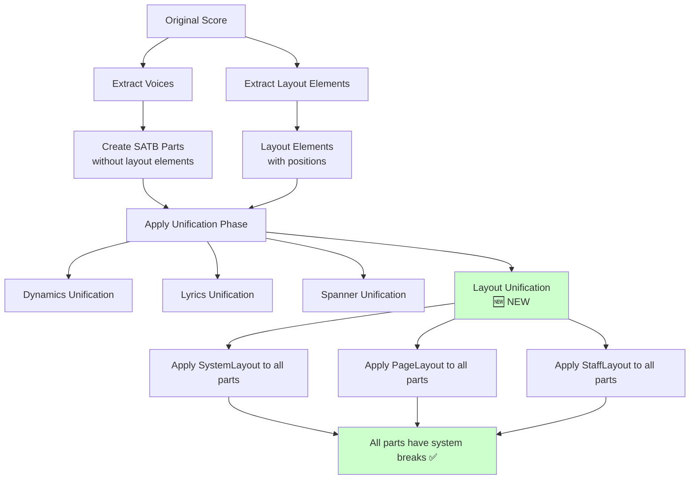

# System Breaks Fix Plan

## Problem Statement

System breaks are currently only applied to the Soprano part, but they should be applied to all SATB parts (Soprano, Alto, Tenor, Bass). This creates inconsistent formatting where only the Soprano part has proper system breaks while the other three parts lack them.

## Root Cause Analysis

The issue is located in [`satb_splitter/voice_splitter.py`](satb_splitter/voice_splitter.py:189-207). Layout elements (including `SystemLayout` which controls system breaks) are only copied from part 1 to prevent duplication of measure-level elements:

```python
# Only add measure-level elements from part 1 to prevent duplication between parts
if part_idx == 0:
    # ... layout elements are only copied here
    for offset, layout in measure_layouts:
        layout_copy = copy.deepcopy(layout)
        target_for_measure_elements.insert(offset, layout_copy)
```

This means:
- ✅ Soprano (from part 1, voice 1) gets system breaks
- ✅ Alto (from part 1, voice 2) gets system breaks  
- ❌ Tenor (from part 2, voice 5) missing system breaks
- ❌ Bass (from part 2, voice 6) missing system breaks

## Solution: Comprehensive Refactor (Option B)

Move layout element handling to the unification phase, similar to how dynamics and spanners are currently handled. This provides a cleaner, more maintainable architecture.

### Phase 1: Extract Layout Elements During Voice Splitting

**File**: [`satb_splitter/voice_splitter.py`](satb_splitter/voice_splitter.py)

1. **Remove layout element copying from measure processing loop** (lines 202-207)
   - Keep dynamics, expressions, and tempo handling as-is
   - Remove the layout element copying code to prevent duplication

2. **Extract layout elements separately**
   - Create a new function `extract_layout_elements_from_score(score)`
   - Extract all layout elements with their measure positions and offsets
   - Return structured data for unification phase

3. **Pass layout elements to unification**
   - Modify the unification call to include layout elements
   - Update function signatures as needed

### Phase 2: Add Layout Element Unification

**File**: [`satb_splitter/unification.py`](satb_splitter/unification.py)

1. **Add layout element extraction function**
   ```python
   def extract_layout_from_score(score):
       """Extract all layout elements from the original score."""
       layout_elements = []
       # Extract SystemLayout, PageLayout, StaffLayout with positions
       return layout_elements
   ```

2. **Add layout element unification function**
   ```python
   def unify_layout_elements(voices_dict, extracted_layouts):
       """Apply layout elements to all SATB parts."""
       # Rule: System breaks apply to all parts
       # Rule: Page breaks apply to all parts  
       # Rule: Staff-specific layouts apply appropriately
   ```

3. **Integrate with existing unification workflow**
   - Update [`apply_unification()`](satb_splitter/unification.py:10) to handle layout elements
   - Ensure proper sequencing with other unification rules

### Phase 3: Layout Element Distribution Rules

**Unification Rules for Layout Elements**:

1. **System Breaks (`SystemLayout`)**
   - **Rule**: Apply to all four SATB parts
   - **Rationale**: System breaks control line breaks and should be consistent across all parts

2. **Page Breaks (`PageLayout`)**
   - **Rule**: Apply to all four SATB parts
   - **Rationale**: Page formatting should be consistent across all parts

3. **Staff Layout (`StaffLayout`)**
   - **Rule**: Apply to all parts, but may need staff-specific adjustments
   - **Rationale**: Staff spacing and formatting should be consistent

### Phase 4: Implementation Details

**New Functions to Add**:

```python
# In voice_splitter.py
def extract_layout_elements_from_score(score):
    """Extract layout elements from original score for unification."""
    pass

# In unification.py  
def extract_layout_from_score(score):
    """Extract layout elements with position information."""
    pass

def unify_layout_elements(voices_dict, extracted_layouts):
    """Apply layout unification rules across all SATB parts."""
    pass

def copy_layout_to_parts(source_layouts, target_part_names, voices_dict):
    """Copy layout elements to target parts."""
    pass
```

**Modified Functions**:

```python
# In voice_splitter.py
def split_satb_voices(file_path):
    # ... existing code ...
    
    # Extract layout elements from original score
    extracted_layouts = extract_layout_elements_from_score(score)
    
    # Apply unification rules including layout
    apply_unification(parts_dict, extracted_layouts)

# In unification.py
def apply_unification(voices_dict, extracted_layouts=None):
    # ... existing dynamics and lyrics unification ...
    
    # Apply layout unification
    if extracted_layouts:
        unify_layout_elements(voices_dict, extracted_layouts)
```

## Implementation Flow Diagram



## Benefits of Comprehensive Refactor

1. **Consistency**: Layout handling follows the same pattern as dynamics and spanners
2. **Maintainability**: Centralized layout logic in unification module
3. **Extensibility**: Easy to add new layout unification rules
4. **Separation of Concerns**: Voice splitting focuses on note extraction, unification handles cross-part logic
5. **Testability**: Layout unification can be tested independently

## Files to Modify

1. **Primary**: [`satb_splitter/voice_splitter.py`](satb_splitter/voice_splitter.py)
   - Remove layout copying from measure loop
   - Add layout extraction function
   - Update unification call

2. **Primary**: [`satb_splitter/unification.py`](satb_splitter/unification.py)
   - Add layout element extraction
   - Add layout unification rules
   - Update main unification function

3. **Testing**: Validate with existing scores to ensure:
   - System breaks appear in all four parts
   - No duplication of other elements
   - Layout formatting is preserved

## Risk Assessment

**Low Risk**: This approach follows established patterns in the codebase and maintains backward compatibility while providing a cleaner architecture for future layout-related features.

## Next Steps

1. Implement layout element extraction in `voice_splitter.py`
2. Add layout unification functions in `unification.py`
3. Test with the existing score to validate the fix
4. Verify no regression in existing functionality