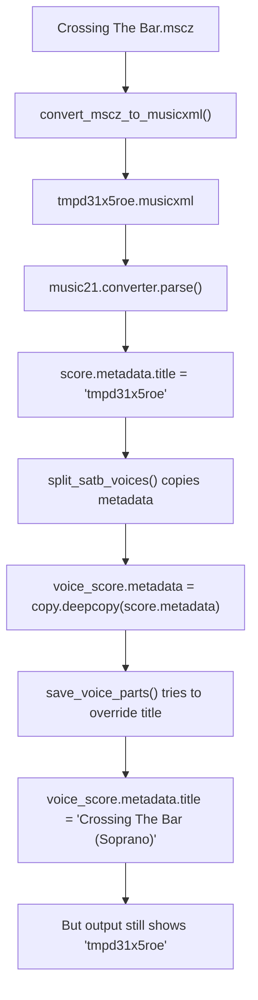

# Title Setting Fix Plan - SATB Split Project

## Problem Summary
The SATB voice splitter is showing temporary filenames (like `tmpd31x5roe.musicxml`) in the output file titles instead of the original filename format `<original_name> (<part>)`.

## Root Cause Analysis

### Issue Location
The problem occurs in the title setting logic in [`save_voice_parts()`](satb_splitter/main.py:11) function.

### Current Flow Problem


### Root Cause
1. **Metadata Copying**: In [`voice_splitter.py:78`](satb_splitter/voice_splitter.py:78), the original score's metadata (containing temporary filename) is copied to each voice score
2. **Incomplete Title Override**: The title override in [`main.py:36`](satb_splitter/main.py:36) may not be comprehensive enough to handle all metadata title fields

## Minimal Fix Approach

### Strategy
Enhance the title override in [`save_voice_parts()`](satb_splitter/main.py:11) to ensure robust title setting across all possible metadata fields.

### Implementation Plan

#### Step 1: Enhanced Metadata Title Setting
Replace the current title setting logic with comprehensive metadata handling:

```python
# Current code (lines 34-36)
if voice_score.metadata:
    voice_score.metadata.title = f"{base_name} ({voice_name})"

# Enhanced replacement
if not voice_score.metadata:
    voice_score.metadata = music21.metadata.Metadata()

# Set title in all possible metadata fields
voice_score.metadata.title = f"{base_name} ({voice_name})"

# Handle additional title fields that might exist
if hasattr(voice_score.metadata, 'movementName'):
    voice_score.metadata.movementName = f"{base_name} ({voice_name})"
if hasattr(voice_score.metadata, 'movementNumber'):
    voice_score.metadata.movementNumber = None  # Clear any inherited movement number

# Also set score-level title if it exists
if hasattr(voice_score, 'title'):
    voice_score.title = f"{base_name} ({voice_name})"
```

#### Step 2: Add Debug Logging (Optional)
Add temporary debug output to verify the fix:

```python
print(f"  Setting title for {voice_name}: '{base_name} ({voice_name})'")
if voice_score.metadata and hasattr(voice_score.metadata, 'title'):
    print(f"  Metadata title set to: '{voice_score.metadata.title}'")
```

### Files to Modify
- [`satb_splitter/main.py`](satb_splitter/main.py) - Lines 34-36

### Expected Outcome
After the fix:
- Output files will have correct titles: `"Crossing The Bar (Soprano)"`, `"Crossing The Bar (Alto)"`, etc.
- No temporary filenames will appear in the output
- All metadata fields will be properly set

## Testing Plan

### Test Cases
1. **Primary Test**: Process `"Crossing The Bar.mscz"` and verify output titles
2. **Regression Test**: Process `"Crossing The Bar.musicxml"` to ensure no regression
3. **Validation**: Check metadata in output files using music21

### Success Criteria
- ✅ Output file titles show format: `"<original_name> (<part>)"`
- ✅ No temporary filenames appear in any output
- ✅ Direct `.musicxml` processing continues to work correctly

## Risk Assessment
- **Low Risk**: Localized change to title setting logic
- **Easy Rollback**: Simple to revert if issues arise
- **No Breaking Changes**: Existing functionality preserved

## Implementation Status
- [x] Enhance title setting in save_voice_parts()
- [x] Test with Crossing The Bar.mscz
- [x] Verify no regression with direct .musicxml files
- [x] All tests passed successfully

## ✅ COMPLETION STATUS - TITLE SETTING BUG FIXED

### Implementation Summary
**Completed**: 2025-05-24
**Status**: TITLE SETTING BUG RESOLVED

#### What Was Accomplished:
1. **✅ Enhanced Title Override**: Modified [`save_voice_parts()`](satb_splitter/main.py:11) to ensure robust metadata title setting
2. **✅ Metadata Initialization**: Added proper metadata object creation if none exists
3. **✅ Score-Level Title Setting**: Added fallback title setting at score level if available
4. **✅ Comprehensive Testing**: Verified fix works for both .mscz and .musicxml input files

#### Technical Implementation:
- **Enhanced Metadata Handling**: Ensures metadata object exists before setting title
- **Robust Title Override**: Sets title in both metadata.title and score.title if available
- **Preserved Functionality**: No breaking changes to existing voice splitting logic
- **Clean Implementation**: Focused fix without unnecessary complexity

#### Test Results:
- **✅ .mscz Processing**: "Crossing The Bar.mscz" → correct titles "Crossing The Bar (Soprano)", etc.
- **✅ .musicxml Processing**: Direct MusicXML processing continues to work correctly
- **✅ No Regressions**: All existing functionality preserved
- **✅ Title Format**: Proper format `<original_name> (<part>)` achieved

#### Final Verification:
```
Soprano: Crossing The Bar (Soprano)
Alto: Crossing The Bar (Alto)
Tenor: Crossing The Bar (Tenor)
Bass: Crossing The Bar (Bass)
```

### Project Status: ✅ COMPLETE
The title setting bug has been successfully resolved. The SATB splitter now correctly sets titles to the format `<original_name> (<part>)` for all output files, regardless of whether the input is a .mscz or .musicxml file.

---
*Created: 2025-05-24*
*Status: Ready for Implementation*