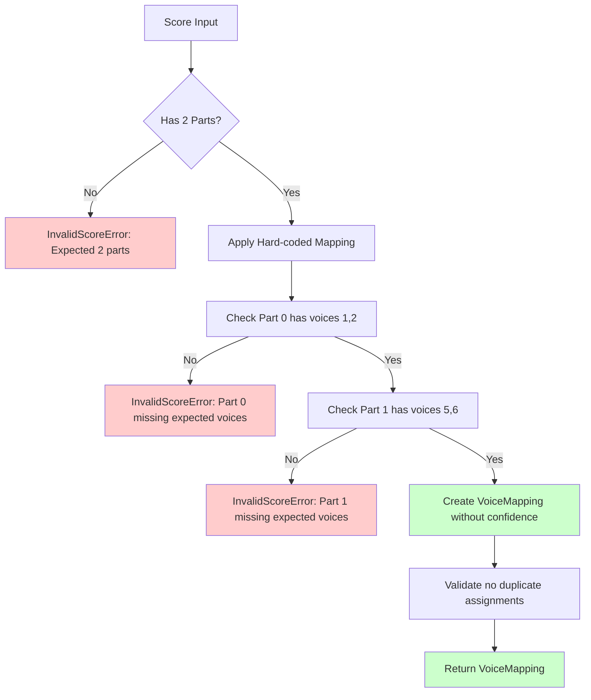

# Voice Identification Hard-Coding Implementation Plan

## Overview

This document outlines the plan to simplify the SATB voice identification system by removing all fallback logic and strictly enforcing hard-coded voice mappings.

## Current System Analysis

### Existing Implementation
- File: [`satb_splitter/voice_identifier.py`](satb_splitter/voice_identifier.py)
- Class: [`DeterministicVoiceIdentifier`](satb_splitter/voice_identifier.py:12)
- Current behavior: Uses hard-coded mappings with fallback logic when expected voices don't exist

### Current Hard-Coded Mapping
```python
expected_mapping = {
    'soprano': {'part_index': 0, 'voice_id': '1'},
    'alto': {'part_index': 0, 'voice_id': '2'},
    'tenor': {'part_index': 1, 'voice_id': '5'},
    'bass': {'part_index': 1, 'voice_id': '6'}
}
```

### Problems with Current System
- Complex fallback logic in [`_find_fallback_voice`](satb_splitter/voice_identifier.py:117) method
- Confidence scoring that suggests uncertainty
- Adaptive behavior that can mask structural issues
- Warning messages that imply the system is guessing

## Proposed Changes

### 1. Remove Fallback Logic
**Target**: [`_find_fallback_voice`](satb_splitter/voice_identifier.py:117) method (lines 117-156)
- **Action**: Delete entire method
- **Reason**: We want strict enforcement, no adaptation

### 2. Simplify [`analyze_score`](satb_splitter/voice_identifier.py:32) Method
**Current behavior** (lines 42-68):
- Validates score has 2 parts
- Discovers available voices in each part
- Applies deterministic rules with fallback
- Validates mapping

**New behavior**:
- Validate score has 2 parts
- Apply hard-coded mapping directly
- Verify expected voices exist (fail if not)
- Return mapping with confidence=1.0

### 3. Simplify [`_apply_deterministic_rules`](satb_splitter/voice_identifier.py:70) Method
**Current behavior** (lines 70-115):
- Checks if expected voice exists
- Calls fallback logic if not found
- Sets variable confidence scores
- Uses status indicators

**New behavior**:
- Use only hard-coded mapping
- Verify voices exist in score (throw error if not)
- Remove confidence scoring entirely
- Remove status indicators

### 4. Remove Confidence Scoring System Entirely
**Current behavior**:
- [`VoiceLocation`](satb_splitter/utils.py:11) has confidence field (default 1.0)
- [`VoiceMapping`](satb_splitter/utils.py:20) has confidence field (default 1.0)
- Confidence calculations in [`_apply_deterministic_rules`](satb_splitter/voice_identifier.py:70)
- Confidence validation in [`_validate_mapping`](satb_splitter/voice_identifier.py:158)

**New behavior**:
- Remove confidence parameter from [`VoiceLocation`](satb_splitter/utils.py:11) dataclass
- Remove confidence parameter from [`VoiceMapping`](satb_splitter/utils.py:20) dataclass
- Remove all confidence-related logic from voice identification
- Remove confidence validation methods

### 5. Simplify [`_validate_mapping`](satb_splitter/voice_identifier.py:158) Method
**Current behavior** (lines 158-181):
- Checks confidence levels
- Warns about low confidence
- Checks for duplicate assignments

**New behavior**:
- Keep duplicate assignment check only
- Remove confidence-related validation
- Remove warning messages

### 6. Error Handling Strategy
**Replace fallbacks with immediate failures**:
- Use [`InvalidScoreError`](satb_splitter/exceptions.py) for structural mismatches
- Provide clear error messages about expected vs actual structure
- No suggestions about alternative mappings

## Implementation Details

### Modified Class Structure

```python
class DeterministicVoiceIdentifier:
    """Hard-coded voice identifier with strict enforcement."""
    
    def __init__(self, score: music21.stream.Score):
        self.score = score
    
    def analyze_score(self) -> VoiceMapping:
        """Apply strict hard-coded voice mapping."""
        # 1. Validate 2-part structure
        # 2. Apply hard-coded mapping
        # 3. Verify voices exist (fail if not)
        # 4. Return mapping
    
    def _apply_deterministic_rules(self) -> VoiceMapping:
        """Apply hard-coded rules without fallback."""
        # 1. Use expected_mapping directly
        # 2. Verify each voice exists in score
        # 3. Create VoiceLocation objects (no confidence)
    
    def _validate_mapping(self, voice_mapping: VoiceMapping) -> None:
        """Basic validation without confidence system."""
        # 1. Check for duplicate assignments only
        # 2. No confidence-related validation
    
    def _determine_clef_type(self, voice_name: str, part_index: int) -> str:
        """Unchanged - determine clef by voice name."""
        # Keep existing logic
```

### Error Messages

**Before**:
```
⚠️  Warning: Some voice assignments have low confidence
Fallback: soprano using only available voice 1
```

**After**:
```
InvalidScoreError: Expected voice '1' not found in part 0. 
Required SATB structure: Part 0 (voices 1,2), Part 1 (voices 5,6)
```

## Benefits

### 1. Predictable Behavior
- No adaptive logic that might mask issues
- Always uses same mapping for same input structure
- Deterministic failures for invalid structures

### 2. Simpler Code
- Removes ~40 lines of fallback logic
- Eliminates confidence calculation complexity
- Reduces decision trees and conditional paths

### 3. Faster Execution
- No voice discovery scanning
- No confidence system overhead
- Direct mapping application

### 4. Clearer Error Reporting
- Immediate failures with specific requirements
- No ambiguous warning messages
- Clear indication of expected structure

### 5. Easier Maintenance
- Less code to test and maintain
- Fewer edge cases to handle
- Simpler debugging process

## Implementation Steps

### Step 1: Modify [`analyze_score`](satb_splitter/voice_identifier.py:32) Method
1. Keep part count validation
2. Remove voice discovery logic
3. Call simplified [`_apply_deterministic_rules`](satb_splitter/voice_identifier.py:70)
4. Remove complex validation

### Step 2: Simplify [`_apply_deterministic_rules`](satb_splitter/voice_identifier.py:70) Method
1. Remove fallback logic calls
2. Verify voices exist directly
3. Remove confidence parameters
4. Remove status messages

### Step 3: Delete [`_find_fallback_voice`](satb_splitter/voice_identifier.py:117) Method
1. Remove entire method (lines 117-156)
2. Update any references

### Step 4: Simplify [`_validate_mapping`](satb_splitter/voice_identifier.py:158) Method
1. Keep duplicate check only
2. Remove entire confidence system
3. Remove warning messages

### Step 5: Update Error Handling
1. Add specific error messages
2. Use [`InvalidScoreError`](satb_splitter/exceptions.py) for structure mismatches
3. Remove adaptive suggestions

## Flow Diagram



## Testing Considerations

### Valid Cases
- Scores with exact expected structure should work unchanged
- No confidence scores (system removed)
- No warning messages should appear

### Invalid Cases
- Scores missing expected voices should fail immediately
- Clear error messages should indicate what's wrong
- No fallback attempts should occur

### Edge Cases to Remove
- Single voice per part handling
- Alternative voice ID mappings
- Any confidence-based logic

## Files to Modify

1. **Primary**: [`satb_splitter/voice_identifier.py`](satb_splitter/voice_identifier.py)
   - Modify [`DeterministicVoiceIdentifier`](satb_splitter/voice_identifier.py:12) class
   - Remove fallback logic
   - Remove confidence system
   - Simplify validation

2. **Data Classes**: [`satb_splitter/utils.py`](satb_splitter/utils.py)
   - Remove confidence field from [`VoiceLocation`](satb_splitter/utils.py:11) dataclass
   - Remove confidence field from [`VoiceMapping`](satb_splitter/utils.py:20) dataclass

3. **Testing**: Update relevant test files to expect strict behavior
   - Remove tests for fallback scenarios
   - Remove tests for confidence scoring
   - Add tests for clear error conditions

## Backward Compatibility

This is a **breaking change** that will affect:
- Scores that previously worked with fallback logic
- Code expecting adaptive behavior
- Code accessing confidence scores (removed entirely)
- Tests assuming confidence scoring or fallback behavior

Users will need to ensure their input scores have the exact expected voice structure.