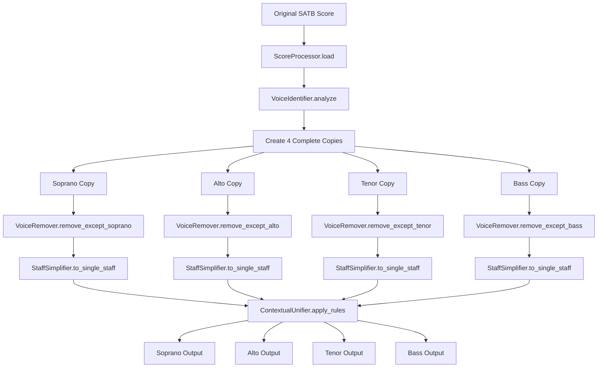

# SATB Split V2: Copy-and-Remove Architecture

## Overview

This document outlines the new design for the SATB split system that addresses the limitations of the current extract-and-build approach. Instead of extracting individual voice elements and building new scores, we copy the entire base score for each voice and remove the unwanted voices.

## Current System Problems

### 1. Complex Voice Mapping Logic
- Hard-coded voice mappings: `(0, '1'): soprano_measure`, `(1, '6'): bass_measure`
- Fragile assumptions about voice IDs and part structure
- Difficult to maintain and extend

### 2. Data Loss Issues
- Only copies enumerated elements (notes, dynamics, lyrics, spanners)
- Loses other musical data like articulations, ornaments, text expressions
- Missing metadata and score-level information

### 3. Timing and Offset Corruption
- Manual offset management when building new measures
- Risk of timing corruption during element insertion
- Complex measure-level element handling

### 4. Complex Unification Rules
- Heuristic-based rules without full context
- Difficult to debug and maintain
- Special case handling for different element types

## New Design Philosophy

### Core Principle: Preserve Everything, Remove Selectively

Instead of:
```
Original Score → Extract Elements → Build New Scores
```

We use:
```
Original Score → Copy Complete Score × 4 → Remove Unwanted Voices → Simplify Layout
```

## Architecture Overview



## Module Design

### 1. VoiceIdentifier
**Purpose**: Automatically detect voice locations in the score

```python
class VoiceIdentifier:
    def analyze_score(self, score: music21.stream.Score) -> VoiceMapping:
        """Analyze score structure to identify SATB voice locations"""
        
    def detect_voice_patterns(self) -> Dict[str, VoiceLocation]:
        """Detect common SATB voice arrangement patterns"""
        
    def validate_voice_mapping(self, mapping: VoiceMapping) -> bool:
        """Validate that detected mapping makes musical sense"""
```

**Key Features**:
- Automatic detection of voice arrangements
- Support for different SATB layouts (closed score, open score, etc.)
- Validation of voice assignments
- Fallback to manual mapping if auto-detection fails

### 2. VoiceRemover
**Purpose**: Remove unwanted voices while preserving all other musical data

```python
class VoiceRemover:
    def remove_voices_except(self, score: music21.stream.Score, 
                           keep_voice: VoiceLocation) -> music21.stream.Score:
        """Remove all voices except the specified one"""
        
    def clean_empty_measures(self, score: music21.stream.Score):
        """Clean up measures that become empty after voice removal"""
        
    def preserve_non_voice_elements(self, measure: music21.stream.Measure):
        """Ensure non-voice elements are preserved during removal"""
```

**Key Features**:
- Surgical voice removal without affecting other elements
- Preservation of dynamics, lyrics, spanners, layout elements
- Smart handling of empty measures
- Maintains original timing and structure

### 3. StaffSimplifier
**Purpose**: Convert multi-staff scores to single-staff layout for each voice

```python
class StaffSimplifier:
    def convert_to_single_staff(self, score: music21.stream.Score, 
                              voice_type: str) -> music21.stream.Score:
        """Convert to single staff with appropriate clef"""
        
    def merge_staff_elements(self, parts: List[music21.stream.Part]) -> music21.stream.Part:
        """Merge elements from multiple staves into single staff"""
        
    def set_appropriate_clef(self, part: music21.stream.Part, voice_type: str):
        """Set clef appropriate for voice type"""
```

**Key Features**:
- Intelligent staff merging
- Automatic clef selection (Treble for S/A, Bass for T/B)
- Preservation of all musical elements during simplification
- Proper part naming and metadata

### 4. ContextualUnifier
**Purpose**: Apply simplified unification rules with full score context

```python
class ContextualUnifier:
    def apply_unification_rules(self, voice_scores: Dict[str, music21.stream.Score]):
        """Apply unification with complete context"""
        
    def unify_dynamics(self, voice_scores: Dict[str, music21.stream.Score]):
        """Smart dynamics unification based on actual content"""
        
    def unify_lyrics(self, voice_scores: Dict[str, music21.stream.Score]):
        """Intelligent lyrics distribution"""
        
    def unify_spanners(self, voice_scores: Dict[str, music21.stream.Score]):
        """Context-aware spanner unification"""
```

**Key Features**:
- Cross-reference between all voice scores for smart decisions
- Context-aware unification (not just heuristic-based)
- Simplified rules due to complete information
- Configurable unification policies

### 5. ScoreProcessor
**Purpose**: Main orchestration and workflow management

```python
class ScoreProcessor:
    def process_satb_score(self, input_file: str) -> Dict[str, music21.stream.Score]:
        """Main processing pipeline"""
        
    def create_voice_copies(self, original: music21.stream.Score) -> Dict[str, music21.stream.Score]:
        """Create complete copies for each voice"""
        
    def validate_output(self, voice_scores: Dict[str, music21.stream.Score]) -> bool:
        """Validate that output scores are correct"""
```

## Simplified Unification Rules

With complete score context, unification becomes much simpler:

### 1. Dynamics Unification
```python
def unify_dynamics(self, voice_scores):
    """
    Rules:
    1. If dynamic appears in multiple voices at same time → apply to all
    2. If dynamic only in Soprano → apply to all (traditional rule)
    3. If dynamics differ between voices → keep voice-specific
    """
```

### 2. Lyrics Unification
```python
def unify_lyrics(self, voice_scores):
    """
    Rules:
    1. If lyrics in one voice but not others at same position → copy to all
    2. If different lyrics in different voices → keep voice-specific
    3. Preserve syllabic information during copying
    """
```

### 3. Spanners Unification
```python
def unify_spanners(self, voice_scores):
    """
    Rules:
    1. System-wide spanners (tempo, rehearsal marks) → apply to all
    2. Voice-specific spanners (slurs, ties) → keep with original voice
    3. Ambiguous spanners → use context to decide
    """
```

## Implementation Plan

### Phase 1: Core Infrastructure
1. Create module structure
2. Implement `VoiceIdentifier` with basic pattern detection
3. Implement `VoiceRemover` with surgical removal logic
4. Basic testing with simple SATB files

### Phase 2: Staff Simplification
1. Implement `StaffSimplifier` for single-staff conversion
2. Handle clef assignment and part naming
3. Test with complex layouts

### Phase 3: Contextual Unification
1. Implement `ContextualUnifier` with simplified rules
2. Cross-reference logic between voice scores
3. Configurable unification policies

### Phase 4: Integration and Testing
1. Implement `ScoreProcessor` orchestration
2. Integration with existing CLI interface
3. Comprehensive testing with existing test files
4. Performance optimization

### Phase 5: Migration
1. Feature flag to switch between old and new approaches
2. Parallel testing and validation
3. Documentation and migration guide
4. Deprecation of old system

## Advantages of New Approach

### 1. No Data Loss
- Complete score copying preserves ALL musical elements
- No need to enumerate every possible element type
- Automatic preservation of future music21 features

### 2. Simplified Logic
- Voice removal is conceptually simpler than selective extraction
- Clear separation of concerns between modules
- Easier to debug and maintain

### 3. Better Timing Preservation
- Original timing relationships maintained throughout
- No manual offset management
- Reduced risk of timing corruption

### 4. Robust Unification
- Full context allows smarter unification decisions
- Cross-reference between voice scores
- Less reliance on heuristics

### 5. Maintainable Code
- Clear module boundaries
- Single responsibility principle
- Easier to extend and modify

## Testing Strategy

### 1. Unit Tests
- Each module tested independently
- Mock objects for complex music21 structures
- Edge case handling

### 2. Integration Tests
- End-to-end processing of test files
- Comparison with current system output
- Validation of musical correctness

### 3. Performance Tests
- Memory usage comparison (copying vs. extraction)
- Processing time benchmarks
- Large file handling

### 4. Regression Tests
- Existing test files must produce equivalent output
- No loss of functionality
- Backward compatibility

## File Structure

```
design_v2/
├── README.md                 # This document
├── architecture.md           # Detailed architecture
├── api_specification.md      # API design
├── migration_guide.md        # Migration from V1
└── testing_plan.md          # Comprehensive testing plan

satb_split_v2/               # Implementation directory
├── __init__.py
├── main.py                  # Entry point and CLI
├── voice_identifier.py      # Voice detection logic
├── voice_remover.py         # Voice removal engine
├── staff_simplifier.py      # Staff layout conversion
├── contextual_unifier.py    # Simplified unification
├── score_processor.py       # Main orchestration
├── utils.py                 # Common utilities
└── tests/                   # Test suite
    ├── test_voice_identifier.py
    ├── test_voice_remover.py
    ├── test_staff_simplifier.py
    ├── test_contextual_unifier.py
    └── test_integration.py
```

## Next Steps

1. **Review and Approval**: Review this design document
2. **Implementation**: Switch to code mode to implement the new architecture
3. **Testing**: Validate with existing test files
4. **Integration**: Integrate with existing CLI and workflow
5. **Migration**: Plan migration from current system

This new approach should significantly reduce the complexity of the SATB splitting process while improving reliability and maintainability.