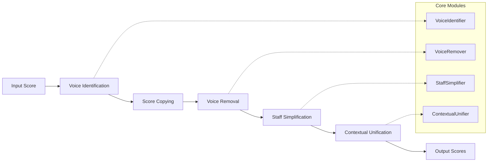

# SATB Split V2: Detailed Architecture

## System Architecture

### Overview
The new SATB split system follows a pipeline architecture with clear separation of concerns. Each stage transforms the data while preserving musical integrity.



## Data Flow Architecture

### 1. Input Processing
```python
# Input: music21.stream.Score (original SATB)
original_score = music21.converter.parse(input_file)

# Voice identification
voice_mapping = VoiceIdentifier.analyze_score(original_score)
# Output: VoiceMapping{soprano: (part=0, voice=1), alto: (part=0, voice=2), ...}
```

### 2. Score Replication
```python
# Create complete copies for each voice
voice_scores = {
    'Soprano': copy.deepcopy(original_score),
    'Alto': copy.deepcopy(original_score),
    'Tenor': copy.deepcopy(original_score),
    'Bass': copy.deepcopy(original_score)
}
```

### 3. Voice Removal
```python
# Remove unwanted voices from each copy
for voice_name, score in voice_scores.items():
    keep_voice = voice_mapping[voice_name]
    VoiceRemover.remove_voices_except(score, keep_voice)
```

### 4. Staff Simplification
```python
# Convert to single-staff layout
for voice_name, score in voice_scores.items():
    voice_scores[voice_name] = StaffSimplifier.convert_to_single_staff(score, voice_name)
```

### 5. Contextual Unification
```python
# Apply unification rules with full context
ContextualUnifier.apply_unification_rules(voice_scores)
```

## Core Data Structures

### VoiceMapping
```python
@dataclass
class VoiceLocation:
    part_index: int
    voice_id: str
    clef_type: str
    
@dataclass
class VoiceMapping:
    soprano: VoiceLocation
    alto: VoiceLocation
    tenor: VoiceLocation
    bass: VoiceLocation
    
    def validate(self) -> bool:
        """Validate that mapping makes musical sense"""
        # Ensure no duplicate locations
        # Verify clef assignments are reasonable
        # Check that all voices are found
```

### ProcessingContext
```python
@dataclass
class ProcessingContext:
    original_score: music21.stream.Score
    voice_mapping: VoiceMapping
    processing_options: Dict[str, Any]
    
    def get_voice_location(self, voice_name: str) -> VoiceLocation:
        """Get location for specific voice"""
        
    def get_all_voices(self) -> List[str]:
        """Get list of all voice names"""
```

## Module Specifications

### 1. VoiceIdentifier

#### Purpose
Automatically detect where SATB voices are located in the score structure.

#### Interface
```python
class VoiceIdentifier:
    def __init__(self, score: music21.stream.Score):
        self.score = score
        self.analysis_cache = {}
    
    def analyze_score(self) -> VoiceMapping:
        """Main entry point for voice analysis"""
        
    def detect_part_structure(self) -> List[PartInfo]:
        """Analyze the part structure of the score"""
        
    def detect_voice_patterns(self) -> Dict[str, VoiceLocation]:
        """Detect common SATB voice arrangement patterns"""
        
    def analyze_pitch_ranges(self) -> Dict[str, PitchRange]:
        """Analyze pitch ranges to help identify voices"""
        
    def validate_voice_mapping(self, mapping: VoiceMapping) -> ValidationResult:
        """Validate that detected mapping makes musical sense"""
```

#### Detection Strategies
1. **Pattern Recognition**: Common SATB layouts (closed score, open score)
2. **Pitch Analysis**: Voice ranges to confirm assignments
3. **Clef Analysis**: Treble/bass clef distribution
4. **Voice ID Analysis**: Common voice numbering schemes
5. **Content Analysis**: Note density and rhythm patterns

#### Fallback Mechanisms
- Manual mapping specification
- Interactive voice assignment
- Default assumptions for common cases

### 2. VoiceRemover

#### Purpose
Surgically remove unwanted voices while preserving all other musical elements.

#### Interface
```python
class VoiceRemover:
    def __init__(self, context: ProcessingContext):
        self.context = context
        self.removal_stats = {}
    
    def remove_voices_except(self, score: music21.stream.Score, 
                           keep_voice: VoiceLocation) -> music21.stream.Score:
        """Remove all voices except the specified one"""
        
    def remove_voice_from_measure(self, measure: music21.stream.Measure, 
                                voice_id: str) -> bool:
        """Remove specific voice from a measure"""
        
    def preserve_non_voice_elements(self, measure: music21.stream.Measure):
        """Ensure non-voice elements are preserved"""
        
    def clean_empty_measures(self, score: music21.stream.Score):
        """Handle measures that become empty after removal"""
        
    def get_removal_statistics(self) -> Dict[str, int]:
        """Get statistics about what was removed"""
```

#### Removal Strategy
1. **Voice Stream Removal**: Remove specific voice streams from measures
2. **Element Preservation**: Keep dynamics, lyrics, spanners, layout elements
3. **Timing Preservation**: Maintain original timing structure
4. **Measure Integrity**: Handle empty measures appropriately

#### Safety Mechanisms
- Validation before removal
- Rollback capability for failed operations
- Detailed logging of removal operations
- Preservation of critical musical elements

### 3. StaffSimplifier

#### Purpose
Convert multi-staff scores to single-staff layout appropriate for each voice.

#### Interface
```python
class StaffSimplifier:
    def __init__(self, context: ProcessingContext):
        self.context = context
        self.clef_mappings = self._init_clef_mappings()
    
    def convert_to_single_staff(self, score: music21.stream.Score, 
                              voice_type: str) -> music21.stream.Score:
        """Convert to single staff with appropriate clef"""
        
    def merge_staff_elements(self, parts: List[music21.stream.Part]) -> music21.stream.Part:
        """Merge elements from multiple staves into single staff"""
        
    def set_appropriate_clef(self, part: music21.stream.Part, voice_type: str):
        """Set clef appropriate for voice type"""
        
    def update_part_metadata(self, part: music21.stream.Part, voice_type: str):
        """Update part name and other metadata"""
        
    def handle_cross_staff_elements(self, score: music21.stream.Score) -> music21.stream.Score:
        """Handle elements that span multiple staves"""
```

#### Simplification Strategy
1. **Staff Merging**: Combine remaining content into single staff
2. **Clef Assignment**: Appropriate clef for voice type
3. **Metadata Update**: Part names, instrument assignments
4. **Layout Cleanup**: Remove unnecessary layout elements
5. **Cross-staff Handling**: Manage elements spanning multiple staves

#### Clef Assignment Rules
- Soprano: Treble clef
- Alto: Treble clef
- Tenor: Bass clef (with optional treble clef 8va bassa)
- Bass: Bass clef

### 4. ContextualUnifier

#### Purpose
Apply simplified unification rules using complete score context.

#### Interface
```python
class ContextualUnifier:
    def __init__(self, context: ProcessingContext):
        self.context = context
        self.unification_rules = self._load_rules()
    
    def apply_unification_rules(self, voice_scores: Dict[str, music21.stream.Score]):
        """Apply all unification rules"""
        
    def unify_dynamics(self, voice_scores: Dict[str, music21.stream.Score]):
        """Smart dynamics unification"""
        
    def unify_lyrics(self, voice_scores: Dict[str, music21.stream.Score]):
        """Intelligent lyrics distribution"""
        
    def unify_spanners(self, voice_scores: Dict[str, music21.stream.Score]):
        """Context-aware spanner unification"""
        
    def unify_tempo_markings(self, voice_scores: Dict[str, music21.stream.Score]):
        """Tempo and expression markings unification"""
        
    def cross_reference_elements(self, voice_scores: Dict[str, music21.stream.Score]) -> Dict[str, Any]:
        """Cross-reference elements between voice scores"""
```

#### Unification Strategies

##### Dynamics Unification
```python
def unify_dynamics(self, voice_scores):
    # 1. Find dynamics that appear in multiple voices at same time
    common_dynamics = self.find_common_dynamics(voice_scores)
    
    # 2. Apply system-wide dynamics to all voices
    for dynamic_info in common_dynamics:
        self.apply_to_all_voices(dynamic_info, voice_scores)
    
    # 3. Handle Soprano-only dynamics (traditional rule)
    soprano_only = self.find_soprano_only_dynamics(voice_scores)
    for dynamic_info in soprano_only:
        self.apply_to_all_voices(dynamic_info, voice_scores)
```

##### Lyrics Unification
```python
def unify_lyrics(self, voice_scores):
    # 1. Find positions where some voices have lyrics, others don't
    lyric_gaps = self.find_lyric_gaps(voice_scores)
    
    # 2. Fill gaps with lyrics from other voices
    for gap_info in lyric_gaps:
        self.fill_lyric_gap(gap_info, voice_scores)
    
    # 3. Preserve voice-specific lyrics where they exist
    # (No action needed - already preserved)
```

##### Spanner Unification
```python
def unify_spanners(self, voice_scores):
    # 1. Identify system-wide spanners (tempo, rehearsal marks)
    system_spanners = self.identify_system_spanners(voice_scores)
    
    # 2. Apply system spanners to all voices
    for spanner_info in system_spanners:
        self.apply_to_all_voices(spanner_info, voice_scores)
    
    # 3. Keep voice-specific spanners (slurs, ties) with original voice
    # (Already preserved by voice removal process)
```

## Error Handling and Recovery

### Error Categories
1. **Input Validation Errors**: Invalid score format, missing voices
2. **Processing Errors**: Voice removal failures, timing corruption
3. **Output Validation Errors**: Invalid output scores, missing elements

### Recovery Strategies
1. **Graceful Degradation**: Fall back to simpler processing when complex operations fail
2. **Rollback Capability**: Restore previous state when operations fail
3. **Alternative Approaches**: Try different voice detection strategies
4. **User Intervention**: Request manual input when automatic detection fails

### Validation Framework
```python
class ValidationFramework:
    def validate_input_score(self, score: music21.stream.Score) -> ValidationResult:
        """Validate input score structure"""
        
    def validate_voice_mapping(self, mapping: VoiceMapping) -> ValidationResult:
        """Validate voice mapping makes sense"""
        
    def validate_processing_step(self, before: music21.stream.Score, 
                                after: music21.stream.Score) -> ValidationResult:
        """Validate that processing step preserved musical integrity"""
        
    def validate_output_scores(self, voice_scores: Dict[str, music21.stream.Score]) -> ValidationResult:
        """Validate final output scores"""
```

## Performance Considerations

### Memory Management
- **Deep Copying**: Four complete score copies require significant memory
- **Lazy Evaluation**: Defer expensive operations until needed
- **Garbage Collection**: Explicit cleanup of intermediate objects
- **Memory Monitoring**: Track memory usage during processing

### Processing Optimization
- **Parallel Processing**: Process voice scores independently where possible
- **Caching**: Cache expensive analysis results
- **Incremental Processing**: Process measures incrementally for large scores
- **Early Termination**: Stop processing on critical errors

### Scalability
- **Large Scores**: Handle scores with many measures efficiently
- **Complex Arrangements**: Support non-standard SATB arrangements
- **Batch Processing**: Process multiple files efficiently
- **Resource Limits**: Respect system memory and processing limits

## Testing Architecture

### Unit Testing Strategy
```python
# Test each module independently
class TestVoiceIdentifier:
    def test_standard_satb_detection(self):
        """Test detection of standard SATB arrangement"""
        
    def test_open_score_detection(self):
        """Test detection of open score arrangement"""
        
    def test_edge_cases(self):
        """Test edge cases and error conditions"""

class TestVoiceRemover:
    def test_surgical_removal(self):
        """Test that only target voices are removed"""
        
    def test_element_preservation(self):
        """Test that non-voice elements are preserved"""
        
    def test_timing_integrity(self):
        """Test that timing is preserved during removal"""
```

### Integration Testing Strategy
```python
class TestIntegration:
    def test_end_to_end_processing(self):
        """Test complete processing pipeline"""
        
    def test_output_equivalence(self):
        """Test that output is equivalent to current system"""
        
    def test_musical_correctness(self):
        """Test that output is musically correct"""
```

### Performance Testing Strategy
```python
class TestPerformance:
    def test_memory_usage(self):
        """Test memory usage with large scores"""
        
    def test_processing_time(self):
        """Test processing time benchmarks"""
        
    def test_scalability(self):
        """Test behavior with very large inputs"""
```

This architecture provides a solid foundation for implementing the new SATB split system with improved maintainability, reliability, and extensibility.